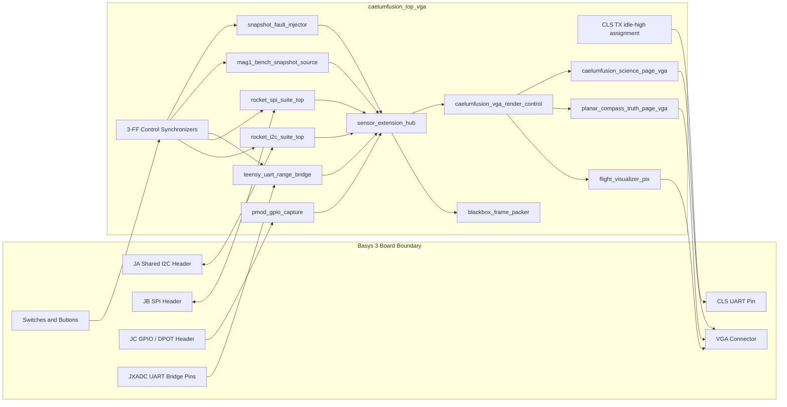
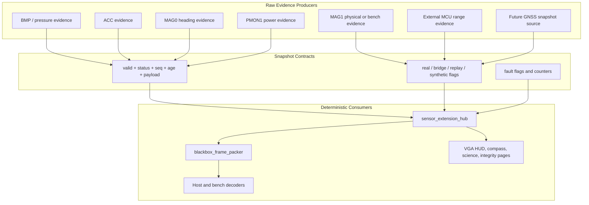
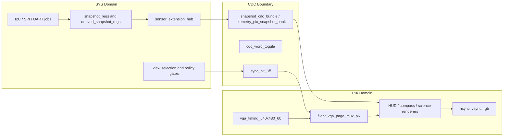
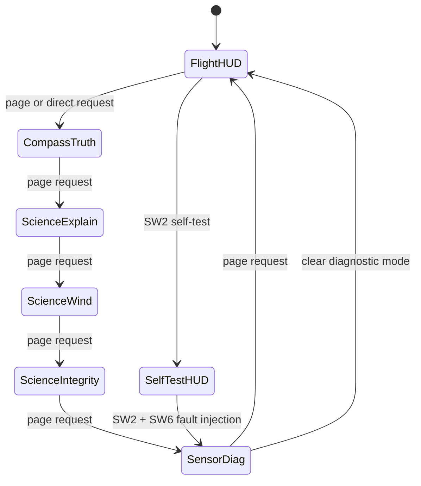
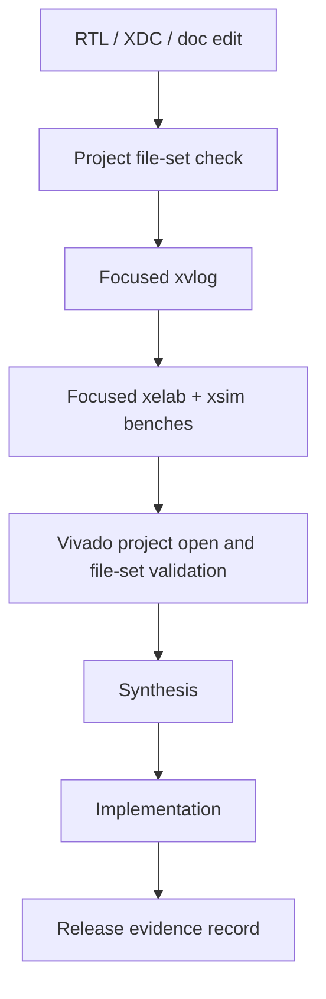

# CaelumFusion Flight Control System

CaelumFusion Flight Control System is a Vivado RTL project for a Basys 3 class
flight-control visualization, sensor-integration, and bench-instrumentation
stack. The repository is organized around a board-facing VGA top module,
deterministic raw telemetry snapshots, explicit source provenance, focused
testbenches, and documentation that separates implemented behavior from
planned or bench-only evidence.

The active hardware image is not just a display demo. It is an FPGA-side
engineering instrument for observing avionics data quality: validity, status,
freshness, sequence alignment, fault flags, source flags, diagnostic injection,
bus counters, and frame-stable VGA views are first-class outputs.

## Current Baseline

| Item | Current contract |
| --- | --- |
| Board class | Digilent Basys 3 / Artix-7 |
| FPGA part | `xc7a35tcpg236-3` |
| Vivado project | `CaelumFusion_Flight_Control_System.xpr` |
| Canonical top | `caelumfusion_top_vga` |
| Constraint file | `CaelumFusion_Flight_Control_System.srcs/constrs_1/new/Basys-3-Master.xdc` |
| Display output | VGA, 640 x 480 timing |
| Primary RTL tree | `CaelumFusion_Flight_Control_System.srcs/sources_1/new/` |
| Simulation tree | `CaelumFusion_Flight_Control_System.srcs/sim_1/new/` |
| Tooling | Vivado, `xvlog`/`xelab`/`xsim`, PowerShell, Python 3 |
| License | Restrictive all-rights-reserved notice in `LICENSE` |

Tool-version boundary: the checkout path is under a Vivado 2023.2 workspace, but
the `.xpr` currently carries Vivado 2025.1.1 project metadata. Vivado 2023.2 can
compile focused RTL files, but the project file itself should be opened and
validated with a version that understands the current `.xpr` metadata before
making project-level synthesis or timing claims.

## Hardware Interface Contract

The board-level contract is defined by `caelumfusion_top_vga.v` and
`Basys-3-Master.xdc`. Treat the XDC as the electrical source of truth before
moving jumpers or applying external power.

| Interface | RTL ports | Basys 3 mapping | Current role |
| --- | --- | --- | --- |
| SYS clock and reset | `clk`, `rst` | 100 MHz clock on W5, BTNC reset on U18 | System clock source and global reset. |
| VGA | `vga_rgb[11:0]`, `vga_hsync`, `vga_vsync` | Basys 3 VGA pins, HSYNC P19, VSYNC R19 | Canonical 640 x 480 display output. |
| JA shared I2C | `scl`, `sda` | JA3/J2 SCL, JA4/G2 SDA, LVCMOS33 pullups | BMP/LIS3DH/CMPS2/MMC3416/PMON1/LIS2MDL-style evidence bus. |
| JB SPI / ACL2 | `adxl362_cs_n`, `adxl362_mosi`, `adxl362_miso`, `adxl362_sclk`, `adxl362_int1`, `adxl362_int2` | JB pins A14/A16/B15/B16/A17/A15 | ADXL362/Pmod ACL2 SPI evidence path and interrupt inputs. |
| JC GPIO / DPOT | `ls1_s_raw[3:0]`, `pir_motion_raw`, `dpot_cs_n`, `dpot_mosi`, `dpot_sclk` | JC pins K17/M18/N17/P18/L17/M19/P17/R18 | Light, PIR, and reserved digital-potentiometer bench signals. |
| JXADC UART bridge | `teensy_uart_rx_raw`, `teensy_uart_tx` | JXADC XA1_P/J3 input, XA2_P/L3 optional output | 3.3 V external MCU fixed-packet ingress. The active producer example is EK-TM4C123GXL UART1. |
| CLS UART | `cls_tx` | A18, LVCMOS33 | Current canonical top holds this line idle high; CLS modules exist but are not active in `caelumfusion_top_vga`. |

The JXADC bridge is a 3.3 V logic interface. Do not connect 5 V UART signaling
to the FPGA input. In the TM4C producer wiring, PC5/U1TX/J4.05 is the expected
MCU-to-FPGA transmit source for `teensy_uart_rx_raw`; PC4/U1RX is optional for a
future FPGA-to-MCU return path.

Pmod VCC and GND pins are board power rails, not FPGA I/O. Connector diagrams
and bench notes should keep power, ground, and constrained signal pins separate.

## What This Repository Contains

This repository tracks hand-authored project inputs:

- Verilog RTL, headers, and testbenches.
- Basys 3 XDC constraints.
- Vivado project metadata used as a file-set contract.
- Tcl flows for focused synthesis, implementation, and bitstream export.
- Python and WaveForms scripts for bench decoding and analysis.
- External MCU bridge firmware examples.
- Engineering documentation, bring-up guides, release checklists, and LaTeX
  source documents.

This repository intentionally excludes generated Vivado state and heavy build
outputs such as `.runs/`, `.sim/`, `.cache/`, `.hw/`, `.ip_user_files/`,
`.Xil/`, `xsim.dir/`, WDB files, journals, logs, checkpoints, and bitstreams.

## System Architecture

The design is built as a set of explicit evidence producers feeding a single
board-level integration top. Runtime controls select which evidence is live,
which views are shown, and which diagnostics are intentionally injected.

### High Level Architecture




### Architecture
```mermaid
flowchart TB
    Top["caelumfusion_top_vga"]

    %% ============================================================
    %% Runtime control and inclusion policy
    %% ============================================================
    subgraph Runtime["Runtime controls and compile-time inclusion"]
        Params["USE_* generics<br/>elaboration-time hardware inclusion"]
        Buttons["Basys-3 buttons<br/>BTNC rst<br/>BTNU next page<br/>BTND previous page<br/>BTNR direct select"]
        Switches["Basys-3 switches SW0-SW15<br/>arm, policy, self-test, bench, log, sensor gates, view gates, ext gates"]
        ViewArb["caelumfusion_vga_direct_view_arbiter_sys<br/>arbitrates SW13:SW11 view ID vs bench/fault ownership"]
        ViewState["view_sel_sys / cfg_invalid_view_sys<br/>HUD, compass, self-test, sensor diag, science pages"]
    end

    Top --> Params
    Top --> Buttons
    Top --> Switches
    Buttons --> ViewArb
    Switches --> ViewArb
    ViewArb --> ViewState

    %% ============================================================
    %% Physical hardware and external producers
    %% ============================================================
    subgraph Hardware["Hardware and external producers"]
        CMPS2["Pmod CMPS2 / MMC34160PJ<br/>JA3 scl, JA4 sda<br/>7-bit I2C addr 0x30"]
        OptionalI2CDevices["Optional shared-I2C devices<br/>LIS3DH ACC, PMON1, HYGRO, GYRO, LIS2MDL MAG1"]
        ADXL362Dev["ADXL362 SPI accelerometer<br/>optional SPI ACC source"]
        GPIODev["Pmod GPIO / discrete inputs"]
        TM4C["EK-TM4C123GXL LaunchPad<br/>UART1 PC5/U1TX J4.05<br/>fixed 22-byte packet producer"]
        BenchStim["Synthetic bench/test stimulus<br/>self-test, MAG1 bench, injected faults"]
        HostLogs["Host-side simulation / EKF / GPS / wind logs<br/>not synthesizable VGA payload today"]
    end

    %% ============================================================
    %% SYS-domain acquisition producers
    %% ============================================================
    subgraph SysProducers["SYS-domain acquisition and producer modules"]
        I2CSuite["rocket_i2c_suite_top"]
        I2CJobCtl["i2c_job_mux + i2c_job_arbiter<br/>shared I2C job selection"]
        MMCMagJob["mmc3416_i2c_job<br/>CMPS2 / MAG0 job<br/>probe, init, SET, measure, status poll, burst read"]
        I2COptionalJobs["optional shared-I2C publication paths<br/>LIS3DH ACC, PMON1 PWR, HYGRO, GYRO, LIS2MDL MAG1"]
        I2CSnapRegs["snapshot_regs<br/>I2C publication banks"]

        SPISuite["rocket_spi_suite_top"]
        SPISnapRegs["SPI snapshot publication banks<br/>ADXL362 ACC when included"]

        GPIOCap["pmod_gpio_capture"]

        UARTBridge["teensy_uart_range_bridge<br/>historical RTL name<br/>physical source is TM4C UART1"]
        PacketIngress["teensy_bridge_packet_ingress<br/>A5 5A framed packet ingress"]
        BridgeDiag["UART bridge diagnostics<br/>heartbeat age, range age, checksum fault,<br/>unsupported packet, stale heartbeat"]
        RangeEvidence["rng_* evidence<br/>ext_rng_height_cm"]

        BenchMag["mag1_bench_snapshot_source<br/>synthetic MAG1 source"]
        ExtDiagSource["SW2 synthetic extension diagnostic source<br/>range, air, environment, sun, flow placeholders"]
        FaultInject["snapshot_fault_injector<br/>deterministic diagnostic fault view"]
        NavWind["landing_nav_wind_observer<br/>wind / dispersion evidence if synthesized"]
    end

    Top --> I2CSuite
    Top --> SPISuite
    Top --> GPIOCap
    Top --> UARTBridge
    Top --> BenchMag
    Top --> FaultInject
    Top --> ExtDiagSource
    Top --> NavWind

    Params --> I2CSuite
    Params --> SPISuite
    Params --> UARTBridge
    Params --> BenchMag
    Params --> FaultInject
    Params --> ExtDiagSource
    Params --> NavWind

    Switches --> I2CSuite
    Switches --> SPISuite
    Switches --> UARTBridge
    Switches --> BenchMag
    Switches --> ExtDiagSource
    Switches --> FaultInject
    Switches --> NavWind

    CMPS2 --> I2CSuite
    OptionalI2CDevices --> I2CSuite
    I2CSuite --> I2CJobCtl
    I2CJobCtl --> MMCMagJob
    I2CJobCtl --> I2COptionalJobs
    MMCMagJob --> I2CSnapRegs
    I2COptionalJobs --> I2CSnapRegs

    ADXL362Dev --> SPISuite
    SPISuite --> SPISnapRegs

    GPIODev --> GPIOCap

    TM4C --> UARTBridge
    UARTBridge --> PacketIngress
    PacketIngress --> BridgeDiag
    BridgeDiag --> RangeEvidence

    BenchStim --> BenchMag
    BenchStim --> ExtDiagSource
    BenchStim --> FaultInject

    %% ============================================================
    %% Snapshot model and derived state
    %% ============================================================
    subgraph SnapshotModel["SYS-domain raw snapshots and derived state"]
        RawSnap["raw snapshot buses<br/>48-bit payload + timestamp + sequence + valid + status + freshness"]
        DerState["derived_state_producer<br/>sensor decode, validity, freshness, heading inputs"]
        AttMath["flight_attitude_math_sys<br/>attitude math and planar magnetic heading"]
        DerSnap["derived snapshot buses<br/>altitude, vertical speed, attitude, heading, health metadata"]
    end

    I2CSnapRegs --> RawSnap
    SPISnapRegs --> RawSnap
    GPIOCap --> RawSnap
    RawSnap --> DerState
    DerState --> AttMath
    AttMath --> DerSnap

    %% ============================================================
    %% Evidence aggregation, extension evidence, and logging
    %% ============================================================
    subgraph Evidence["Evidence aggregation and diagnostic logging"]
        ExtHub["sensor_extension_hub<br/>range, air, environment, sun, flow,<br/>MAG1/PWR metadata, source flags"]
        EvidenceView["selected evidence view<br/>normal or fault-injected diagnostic view"]
        Blackbox["blackbox_frame_packer<br/>diagnostic frame request path<br/>version 0x02, 29 x 32-bit words"]
        BlackboxOut["black-box telemetry words<br/>host decoder / evidence archive"]
    end

    RawSnap --> ExtHub
    DerSnap --> ExtHub
    RangeEvidence --> ExtHub
    BenchMag --> ExtHub
    ExtDiagSource --> ExtHub
    NavWind --> ExtHub

    RawSnap --> FaultInject
    DerSnap --> FaultInject
    ExtHub --> FaultInject
    FaultInject --> EvidenceView
    ExtHub --> EvidenceView

    ExtHub --> Blackbox
    Switches --> Blackbox
    Blackbox --> BlackboxOut

    %% ============================================================
    %% SYS-to-PIX visualization publish
    %% ============================================================
    subgraph VizPublish["SYS-to-PIX visualization publication"]
        VizModel["flight_viz_model_sys<br/>SYS-domain visualization model"]
        VizCDC["flight_viz_bundle_cdc<br/>coherent SYS-to-PIX publish<br/>toggle synchronizers"]
        VizSuite["flight_viz_suite_top"]
    end

    RawSnap --> VizModel
    DerSnap --> VizModel
    EvidenceView --> VizModel
    NavWind --> VizModel
    ViewState --> VizModel
    VizModel --> VizCDC
    VizCDC --> VizSuite

    %% ============================================================
    %% PIX-domain render path
    %% ============================================================
    subgraph Render["PIX-domain render path"]
        RenderCtl["caelumfusion_vga_render_control<br/>page select, self-test, invalid-view handling"]
        MainHud["flight_visualizer_pix<br/>main live telemetry HUD"]
        Compass["planar_compass_truth_page_vga<br/>MAG / compass evidence page"]
        Science["caelumfusion_science_page_vga<br/>explain, wind, integrity pages"]
        VGAOut["VGA output<br/>hsync, vsync, rgb"]
    end

    VizSuite --> RenderCtl
    ViewState --> RenderCtl
    Switches --> RenderCtl

    RenderCtl --> MainHud
    RenderCtl --> Compass
    RenderCtl --> Science

    MainHud --> VGAOut
    Compass --> VGAOut
    Science --> VGAOut

    %% ============================================================
    %% Off-FPGA validation, host analysis, and release workflow
    %% ============================================================
    subgraph Validation["Off-FPGA validation, analysis, and release evidence"]
        CMPS2TB["tb_mmc3416_i2c_job<br/>CMPS2 job simulation"]
        I2CMuxTB["tb_mmc3416_i2c_mux_arbiter_continuation<br/>I2C mux / arbiter continuation simulation"]
        TM4CPhase2["TM4C Phase 2 standalone UART validation<br/>PC5 idle-high, 115200 8N1, A5 5A packets"]
        UARTDecoder["decode_tm4c_uart_packets.py<br/>WaveForms byte-export validator"]
        BenchCaptures["bench captures<br/>I2C electrical, UART, VGA boot, stale/error behavior"]
        SynthBase["synth_caelumfusion_top_vga.tcl"]
        SynthTM4C["synth_caelumfusion_top_vga_tm4c_bridge.tcl"]
        ImplBase["impl_caelumfusion_top_vga_from_synth.tcl"]
        ReleaseGate["CaelumFusion L1 avionics release checklist<br/>timing, DRC, CDC, bench evidence, go/no-go"]
        CanonCSV["flight_canonical.csv<br/>host-side EKF/GPS/wind telemetry boundary"]
        LandingTool["landing_dispersion_envelope.py<br/>host-side SVG + summary"]
    end

    MMCMagJob -. verified by .-> CMPS2TB
    I2CJobCtl -. verified by .-> I2CMuxTB
    TM4C -. standalone evidence .-> TM4CPhase2
    TM4CPhase2 -. byte export .-> UARTDecoder
    UARTBridge -. FPGA-connected UART evidence .-> BenchCaptures
    CMPS2 -. I2C electrical and 10 Hz MAG evidence .-> BenchCaptures
    VGAOut -. visualization evidence .-> BenchCaptures

    Top -. baseline build .-> SynthBase
    Top -. TM4C bridge build .-> SynthTM4C
    SynthBase --> ImplBase
    SynthTM4C --> BenchCaptures
    ImplBase --> ReleaseGate
    BenchCaptures --> ReleaseGate
    CMPS2TB --> ReleaseGate
    I2CMuxTB --> ReleaseGate
    UARTDecoder --> ReleaseGate

    HostLogs --> CanonCSV
    CanonCSV --> LandingTool


### Canonical Module Hierarchy

The project is intentionally organized around a board-facing integration top.
Lower modules produce evidence records; they do not directly own display policy
or silently convert missing data into good data.

```mermaid
flowchart TB
    Top["caelumfusion_top_vga"]

    subgraph Inputs["SYS-domain producers"]
        I2CSuite["rocket_i2c_suite_top"]
        SPISuite["rocket_spi_suite_top"]
        GPIOCap["pmod_gpio_capture"]
        UARTBridge["teensy_uart_range_bridge"]
        BenchMag["mag1_bench_snapshot_source"]
        FaultInject["snapshot_fault_injector"]
        NavWind["landing_nav_wind_observer"]
    end

    subgraph Evidence["Evidence aggregation"]
        ExtHub["sensor_extension_hub"]
        Blackbox["blackbox_frame_packer"]
        RawSnap["raw and derived snapshot buses"]
    end

    subgraph Render["PIX-domain render path"]
        RenderCtl["caelumfusion_vga_render_control"]
        MainHud["flight_visualizer_pix"]
        Compass["planar_compass_truth_page_vga"]
        Science["caelumfusion_science_page_vga"]
    end

    Top --> I2CSuite
    Top --> SPISuite
    Top --> GPIOCap
    Top --> UARTBridge
    Top --> BenchMag
    Top --> FaultInject
    Top --> NavWind
    I2CSuite --> RawSnap
    SPISuite --> RawSnap
    GPIOCap --> ExtHub
    UARTBridge --> ExtHub
    BenchMag --> ExtHub
    FaultInject --> ExtHub
    RawSnap --> ExtHub
    ExtHub --> Blackbox
    ExtHub --> RenderCtl
    NavWind --> RenderCtl
    RenderCtl --> MainHud
    RenderCtl --> Compass
    RenderCtl --> Science
```


### Evidence Pipeline

All sensor data is carried as explicit evidence, not as implicit truth. A
snapshot is useful only when its validity, status, age, sequence, payload, and
source provenance are understood together.



| Field | Contract |
| --- | --- |
| `valid` | Payload is currently meaningful for the producer contract. |
| `status` | Encoded reason for OK, missing, stale, timeout, NACK, ID mismatch, config error, or other failure state. |
| `seq` | Producer update sequence used to detect refresh and alignment behavior. |
| `age` | Freshness counter; saturated or stale age must remain visible to consumers. |
| `payload` | Sensor or derived data value with path-specific scaling and units. |
| `source_flags` | Provenance bits for real, bridge, replayed, or synthetic evidence. |
| `fault_flags` | Aggregated disagreement, stale, raw-status, diagnostic, or logging fault indicators. |

### Clocking And CDC Model

The top-level rendering path crosses from system-domain evidence into a pixel
domain. Crossings are modeled explicitly with synchronizers, snapshot registers,
and bundle/toggle CDC modules. Display behavior should remain frame-stable and
active-video gated.



## Implemented Scope And Non-Scope

| Area | Implemented in this repo | Explicitly not claimed |
| --- | --- | --- |
| VGA instrumentation | Frame-stable VGA views, render control, compact science pages, compass/MAG evidence page, diagnostic overlays | HDMI output from this Basys 3 build |
| Sensor transport | Shared I2C jobs, SPI jobs, external UART packet ingress scaffold | Autonomous sensor fusion or flight authority from these sensors |
| MAG0/MAG1 | MAG0 planar heading evidence; MAG1 physical/bench evidence and disagreement metrics | Tilt-compensated or fused heading |
| PMON1 | SW10-gated raw power-bank evidence | Power-control authority |
| Range bridge | Default-off UART packet ingress and MCU producer example | Physical rangefinder driver or range-to-altitude fusion |
| GNSS/nav/wind | Contract placeholders and guarded snapshot sources | Live EKF, GNSS navigation, or wind estimator unless explicitly wired and validated |
| Black-box logging | Deterministic frame packer scaffold | On-FPGA filesystem or SD-card ownership |
| Release evidence | Source, scripts, benches, docs, and checklists | Current timing closure unless a fresh matching-tool run is cited |

## Repository Map

```text
.
|-- CaelumFusion_Flight_Control_System.xpr
|-- CaelumFusion_Flight_Control_System.srcs/
|   |-- constrs_1/new/
|   |   `-- Basys-3-Master.xdc
|   |-- sources_1/new/
|   |   |-- caelumfusion_top_vga.v
|   |   |-- rocket_i2c_suite_top.v
|   |   |-- rocket_spi_suite_top.v
|   |   |-- sensor_extension_hub.v
|   |   |-- caelumfusion_vga_render_control.v
|   |   |-- caelumfusion_science_page_vga.v
|   |   |-- planar_compass_truth_page_vga.v
|   |   |-- flight_visualizer_pix.v
|   |   |-- pmod_gpio_capture.v
|   |   |-- blackbox_frame_packer.v
|   |   |-- teensy_bridge_packet_ingress.v
|   |   |-- teensy_uart_range_bridge.v
|   |   `-- telemetry_defs_vh.vh
|   `-- sim_1/new/
|       |-- tb_i2c_suite_regression_all3_real_engine.v
|       |-- tb_sensor_extension_hub.v
|       |-- tb_snapshot_fault_injector.v
|       |-- tb_mag1_bench_snapshot_source.v
|       |-- tb_caelumfusion_science_page_ext_metadata.v
|       `-- tb_caelumfusion_render_control_switch_encoded.v
|-- docs/
|-- firmware/
|-- tools/
|   |-- vivado/
|   |-- waveforms/
|   `-- analysis/
|-- LICENSE
`-- README.md
```

## Primary RTL Entry Points

| File | Role |
| --- | --- |
| `caelumfusion_top_vga.v` | Board-facing integration top and active Vivado top module. |
| `rocket_i2c_suite_top.v` | Shared I2C sensor suite and optional extension-device paths. |
| `rocket_spi_suite_top.v` | SPI sensor suite. |
| `sensor_extension_hub.v` | Extension evidence summarizer, fault flags, MAG0/MAG1 metrics, range/air/env/sun/flow/log fields. |
| `caelumfusion_vga_render_control.v` | Runtime view selection, direct-select handling, page arbitration, diagnostic visibility policy. |
| `flight_visualizer_pix.v` | Main pixel-domain HUD renderer. |
| `caelumfusion_science_page_vga.v` | Compact science, wind, and integrity evidence pages. |
| `planar_compass_truth_page_vga.v` | Compass/MAG evidence page and redundant-magnetometer visualization. |
| `blackbox_frame_packer.v` | Versioned 32-bit black-box evidence stream packer. |
| `teensy_bridge_packet_ingress.v` | Fixed external-MCU packet ingress contract. |
| `teensy_uart_range_bridge.v` | 8N1 UART wrapper for the external-MCU range evidence path. |
| `nav_wind_snapshot_producer.v` | Future explicit nav/wind binding point. |
| `gnss_bridge_snapshot_source.v` | Future GNSS packet-to-snapshot source contract. |

## Runtime Controls

The detailed control contract lives in
`docs/CaelumFusion_Runtime_Control_Map.md`. The condensed board-facing map is:

### Buttons

| Control | RTL signal | Purpose |
| --- | --- | --- |
| BTNC | `rst` | Global reset. |
| BTNU | `btn_page_raw` | Next visualization page. |
| BTND | `btn_prev_raw` | Previous visualization page. |
| BTNR | `btn_direct_compass_raw` | Direct-select request or compass request, depending on build mode. |
| BTNL | unused | Intentionally unassigned. |

### Switches

| Control | RTL signal | Purpose |
| --- | --- | --- |
| SW0 | `sw_arm_raw` | Software arm visualization gate. |
| SW1 | `sw_policy_enable_raw` | Policy-enable visualization gate. |
| SW2 | `sw_selftest_raw` | Self-test stimulus and synthetic extension diagnostics. |
| SW3 | `sw_mag1_bench_raw` | Synthetic MAG1 bench publication gate when compiled in. |
| SW4 | `sw_compass_page_raw` | Compass/MAG evidence page hold. |
| SW5 | `sw_history_freeze_raw` | Freeze history writes for inspection. |
| SW6 | `sw_log_diag_raw` | Black-box diagnostic requests and deliberate fault injection with SW2. |
| SW7 | `sw_lis3dh_i2c_acc_raw` | LIS3DH I2C accelerometer path gate. |
| SW8 | `sw_adxl362_spi_acc_raw` | ADXL362 SPI accelerometer path gate. |
| SW9 | `sw_cmps2_mmc3416_mag_raw` | CMPS2/MMC3416 MAG0 path gate. |
| SW10 | `sw_pmon1_pwr_raw` | PMON1 power telemetry gate. |
| SW11 | `sw_mag1_offset_x_raw` | MAG1 bench offset X or direct-view bit 0. |
| SW12 | `sw_mag1_offset_y_raw` | MAG1 bench offset Y or direct-view bit 1. |
| SW13 | `sw_mag1_offset_z_raw` | MAG1 bench offset Z or direct-view bit 2. |
| SW14 | `sw_compass_default_raw` | Compass/MAG default or hold companion. |
| SW15 | `sw_ext_i2c_raw` | Optional extension I2C group and external-UART bridge gate. |

SW11, SW12, and SW13 have collision arbitration. MAG1 bench mode and deliberate
fault injection own those switches before encoded direct-view selection. See the
runtime control map before using BTNR direct navigation during bench diagnostics.

## Sensor And Evidence Contracts

### I2C

The I2C suite uses the shared JA bus and an open-drain drive model. The engine
releases high and drives low; bench captures should treat high level as pull-up
or released bus state, not as push-pull high drive.

Representative I2C evidence paths include:

- BMP585 pressure/temperature evidence.
- LIS3DH acceleration evidence.
- CMPS2/MMC3416 MAG0 evidence.
- PMON1 power telemetry evidence at `7'h38`.
- Optional LIS2MDL/MAG1 evidence at `7'h1E`.
- Optional HYGRO/GYRO extension evidence.

### SPI

The SPI suite supports accelerometer and related sensor jobs through explicit
mode-0 style engines and job arbitration. SPI paths are selected through the
compiled top-level build and runtime switch gates.

### GPIO And CLS UART

`pmod_gpio_capture.v` samples the JC light-sensor and PIR inputs and publishes
them as extension evidence with validity, age, source, and payload fields. This
keeps bench GPIO observations inside the same status/freshness model as the
sensor buses.

The repository also contains minimal CLS UART formatter, scheduler, refresh, and
9600-baud transmitter modules. In the canonical `caelumfusion_top_vga` build,
however, `cls_tx` is assigned idle high. Treat the CLS sources as available
implementation scaffolding, not as active hardware behavior, until the top-level
contract is intentionally changed and verified.

### External MCU UART Bridge

The external-MCU bridge keeps the historical `teensy_*` RTL names, but the
active bench producer in this repository is the EK-TM4C123GXL UART1 firmware
example:

```text
firmware/tm4c123gxl_bridge_range_producer/main.c
```

The first implemented packet target is range/AGL evidence. The bridge remains
default-off unless `USE_TEENSY_UART_RANGE_BRIDGE` is enabled and SW15 gates the
accepted packets.

The fixed-packet ingress uses sync word `16'hA55A`, packet types `8'h50`
heartbeat and `8'h51` range/AGL, sequence and timestamp fields, flags, payload,
auxiliary words, and checksum/error counters. The RTL should report malformed,
unsupported, stale, or missing heartbeat conditions through status and diagnostic
counters instead of inventing usable range evidence.

### MAG1 Provenance

MAG1 has two deliberately separated producers:

- Physical LIS2MDL/MAG1 through the shared I2C suite, tagged as real evidence.
- Synthetic MAG1 bench publication through `mag1_bench_snapshot_source.v`,
  tagged with `EXT_SRC_SYNTHETIC_BIT`.

Neither path changes `der_heading_mdeg`. The live heading remains MAG0 planar
`atan2(MY, MX)` until a separate fusion and tilt-compensation contract exists.

### Black-Box Frame Boundary

`blackbox_frame_packer.v` is a storage-agnostic ready/valid stream boundary. It
packs a versioned sequence of 32-bit words from raw snapshots and extension
metadata, including validity, status, age, source flags, sequence fields, and
MAG/range diagnostic context. It does not own an SD card, filesystem, or host
transport. A release should therefore cite both the frame-packer contract and
the downstream storage/decoder that actually captured the frame.

## VGA View Model

The render-control layer chooses among the main HUD, compass evidence, self-test
view, sensor diagnostics, and science pages. The important design rule is that
the view is an engineering instrument: stale, invalid, synthetic, and missing
data must remain visually distinguishable from live validated evidence.

| View ID | View | Notes |
| --- | --- | --- |
| 0 | Flight HUD | Main avionics instrumentation view. |
| 1 | Compass truth | MAG0/MAG1 evidence and heading-health visualization. |
| 2 | Self-test HUD | Deliberate self-test and diagnostic stimulus visibility. |
| 3 | Sensor diagnostics | Status, source, freshness, and fault detail. |
| 4 | Science explain | Compact explanatory science page. |
| 5 | Science wind | Wind/nav scaffold visibility; missing inputs remain explicit. |
| 6 | Science integrity | Extension metadata and integrity visualization. |

`caelumfusion_vga_render_control.v` arbitrates page requests, encoded direct
selection, compass hold behavior, and invalid-view reporting. Unsupported view
IDs should be rejected or made visible as configuration faults rather than
silently falling through to unrelated pages.



## Host-Side Analysis Tools

Host scripts under `tools/analysis/` support design review and regression
analysis, but they are not synthesizable RTL and they do not prove live
navigation or wind binding by themselves.

| Tool | Boundary |
| --- | --- |
| `tools/analysis/landing_dispersion_envelope.py` | Computes and reports a host-side landing-dispersion envelope from supplied data or fixtures. |
| `tools/analysis/export_landing_telemetry_csv.py` | Exports analysis-oriented CSV data for review. |
| `tools/analysis/run_landing_dispersion_regression.py` | Runs host regression checks for the landing-dispersion analysis path. |

Keep host-derived diagnostics distinct from FPGA evidence fields. When nav,
GNSS, wind, or landing estimates are not wired to real snapshot producers, the
FPGA-side renderer should continue to show missing-input or invalid status
rather than borrowing host-analysis outputs as live truth.

## Verification Strategy

Use focused checks before broad project builds. A good verification sequence is:

1. Check the repository is clean except for the files intentionally under test.
2. Confirm new RTL or benches are present in the Vivado `.xpr` file set.
3. Run narrow `xvlog` syntax checks on changed RTL and its direct dependencies.
4. Elaborate and run focused benches in a fresh simulation work library.
5. Open the Vivado project with the matching project version and validate file
   sets.
6. Only then run synthesis, implementation, timing, and DRC reports.



### Recently Useful Focused Benches

| Bench | Purpose |
| --- | --- |
| `tb_i2c_suite_regression_all3_real_engine` | Shared I2C engine guardrail for multiple sensor paths. |
| `tb_rocket_i2c_suite_mag1_physical` | LIS2MDL/MAG1 physical path through the I2C suite. |
| `tb_pmon1_i2c_job` | PMON1 transaction sequence and failure behavior. |
| `tb_rocket_i2c_suite_pmon1` | Suite-level PMON1 gating and NACK/error behavior. |
| `tb_sensor_extension_hub` | Extension evidence, MAG1 metadata, source flags, and fault flags. |
| `tb_snapshot_fault_injector` | Deliberate diagnostic fault injection behavior. |
| `tb_mag1_bench_snapshot_source` | Default-off synthetic MAG1 bench publication contract. |
| `tb_caelumfusion_render_control_switch_encoded` | Encoded switch view selection and arbitration. |
| `tb_caelumfusion_science_page_ext_metadata` | Pixel-level science-page extension-metadata smoke test. |
| `tb_teensy_uart_range_bridge` | UART bridge packet handling and diagnostics. |

### Project File-Set Contract

The `.xpr` is part of the build contract. A file existing on disk is not enough
for project-mode builds. When adding an RTL module or bench:

- Add it under the correct `sources_1` or `sim_1` tree.
- Register it in `CaelumFusion_Flight_Control_System.xpr`.
- Confirm it appears in Vivado's file set.
- Re-check that no `UserDisabled` or stale `IS_ENABLED` metadata hides an active
  source.

## Common Commands

Run these from the repository root unless noted otherwise.

### Inspect Repository State

```powershell
git status --short --branch
git log --oneline --decorate --max-count=5
```

### Open The Project

Prefer the Vivado version that matches the current `.xpr` metadata:

```powershell
& "C:\Xilinx\2025.1.1\Vivado\bin\vivado.bat" `
  "CaelumFusion_Flight_Control_System.xpr"
```

For focused Verilog checks that do not need to open the project, Vivado 2023.2
tool executables may still be useful if they are the intended simulator runtime:

```powershell
& "C:\Xilinx\Vivado\2023.2\bin\xvlog.bat" --relax `
  -i "CaelumFusion_Flight_Control_System.srcs\sources_1\new" `
  "CaelumFusion_Flight_Control_System.srcs\sources_1\new\caelumfusion_science_page_vga.v" `
  "CaelumFusion_Flight_Control_System.srcs\sim_1\new\tb_caelumfusion_science_page_ext_metadata.v"
```

### Elaborate And Run A Focused Bench

```powershell
& "C:\Xilinx\Vivado\2023.2\bin\xelab.bat" --relax --debug typical `
  tb_caelumfusion_science_page_ext_metadata `
  -snapshot tb_caelumfusion_science_page_ext_metadata_snap

& "C:\Xilinx\Vivado\2023.2\bin\xsim.bat" `
  tb_caelumfusion_science_page_ext_metadata_snap -runall
```

### Run Scripted Synthesis Or Implementation

Do not treat these commands as evidence unless the run completes and the
generated reports are archived with the tool version, commit hash, and warning
review.

```powershell
& "C:\Xilinx\2025.1.1\Vivado\bin\vivado.bat" -mode batch `
  -source "tools\vivado\synth_caelumfusion_top_vga.tcl"

& "C:\Xilinx\2025.1.1\Vivado\bin\vivado.bat" -mode batch `
  -source "tools\vivado\impl_caelumfusion_top_vga_from_synth.tcl"
```

### Decode WaveForms I2C Captures

```powershell
python tools\decode_waveforms_i2c.py `
  "captures\basys3_ja_i2c_capture.csv" `
  --scl i2c_scl --sda i2c_sda `
  --csv-out "captures\basys3_ja_i2c_decoded.csv" `
  --json-out "captures\basys3_ja_i2c_decoded.json"
```

## Documentation Index

| Document | Use it for |
| --- | --- |
| `docs/CaelumFusion_Runtime_Control_Map.md` | Live Basys 3 button/switch and parameter contract. |
| `docs/CaelumFusion_Basys3_Pmod_Wiring_Guide.md` | Board wiring, Pmod headers, pullups, safety notes, and bench bring-up. |
| `docs/CaelumFusion_Discovery3_Basys3_Pmod_Instrumentation_Guide.md` | Discovery 3 / WaveForms capture workflow. |
| `docs/CaelumFusion_WaveForms_Decoder_Protocol_Scripts.md` | WaveForms custom decoder and script usage. |
| `docs/CaelumFusion_Extension_Milestones.md` | Implemented extension evidence, MAG1, range, GNSS, black-box, and limitations. |
| `docs/CaelumFusion_TM4C123GXL_UART_Bridge_Bringup.md` | TM4C123GXL external bridge bring-up. |
| `docs/CaelumFusion_Teensy_UART_Bridge_Bringup.md` | Historical Teensy bridge bring-up context. |
| `firmware/tm4c123gxl_bridge_range_producer/README.md` | Active EK-TM4C123GXL fixed-packet range producer firmware boundary. |
| `docs/CaelumFusion_Landing_Dispersion_Envelope.md` | Host analysis and landing-dispersion tooling. |
| `docs/CaelumFusion_L1_Avionics_Release_Checklist.md` | Release gate checklist for flight-image evidence. |
| `docs/bench_captures/index.md` | Bench-capture inventory and evidence status. |

## Bench And Hardware Bring-Up Notes

- Treat all Pmod and JXADC wiring as a contract. Confirm pin mapping against the
  XDC and wiring guide before applying power.
- Never connect 5 V UART directly to FPGA inputs.
- For I2C, verify idle-high level, low-drive behavior, pullups, ACK/NACK
  behavior, and no contention before trusting captured data.
- Keep raw capture exports and decoded protocol outputs as separate artifacts.
- When a capture is incomplete or starts mid-frame, label it as partial evidence
  instead of treating decoder errors as sensor failures.
- Distinguish bench evidence from flight evidence. Synthetic MAG1, simulated
  range, self-test stimulus, and deliberate fault injection must remain visibly
  tagged.

## Release Evidence Boundary

Before a bitstream or timing claim is published, record:

- Git commit hash.
- Vivado version and build number.
- Top module and FPGA part.
- Exact Tcl commands.
- Active source and constraint manifest.
- Simulation benches and PASS logs.
- Synthesis reports.
- Implementation reports.
- Timing summary with setup, hold, and pulse-width status.
- DRC report with every warning fixed or explicitly waived.
- Hardware bench evidence for reset, sensor buses, display output, power, and
  integration safety.

The release checklist in `docs/CaelumFusion_L1_Avionics_Release_Checklist.md`
is the source of truth for flight-style signoff. Older baseline report numbers
inside that checklist are historical unless regenerated against the current
commit and matching Vivado version.

## Known Risks And Review Points

| Risk | Current handling |
| --- | --- |
| Vivado version skew | Project metadata is currently newer than the 2023.2 workspace path. Use matching Vivado for project-level validation. |
| Generated artifacts excluded | Bitstreams, checkpoints, logs, WDBs, and run directories are intentionally not committed. Archive them separately for releases. |
| SCL open-drain interpretation | I2C documentation and captures must treat high as released/pulled-high, not push-pull driven high. |
| Synthetic evidence confusion | Synthetic MAG1 and diagnostic data are explicitly source-flagged and must not be cited as physical flight evidence. |
| Navigation/wind binding | Nav/wind fields are guarded until real estimator sources are wired. Do not infer wind or navigation truth from unrelated raw evidence. |
| Freshness/stale data | Every consumer should preserve age/status semantics rather than silently reusing stale-good payloads. |
| Project file-set drift | New files must be registered in the `.xpr`; disabled project entries can break project-mode builds even when files exist on disk. |
| CLS activation ambiguity | CLS helper modules are present, but `caelumfusion_top_vga` currently drives `cls_tx` idle high. Do not describe CLS output as active without a top-level change and bench evidence. |
| External bridge enablement | The TM4C producer and UART ingress are available, but the FPGA bridge path is default-off through `USE_TEENSY_UART_RANGE_BRIDGE` and SW15. Validate standalone TM4C frames before wiring JXADC. |
| Host-analysis boundary | Landing-dispersion scripts are host diagnostics. They should not be cited as live FPGA nav/wind evidence unless real snapshot producers are wired and verified. |

## Development Workflow

1. Read the relevant RTL, XDC, docs, and benches before editing.
2. Keep changes small enough to review.
3. Preserve single-writer ownership of snapshot banks and status fields.
4. Keep CDC boundaries explicit.
5. Add or update focused benches when behavior changes.
6. Register source and bench files in the `.xpr`.
7. Run narrow simulation or file-set checks before broad synthesis.
8. Update docs when interfaces, switch maps, packet formats, or evidence fields
   change.
9. Commit source changes and exclude generated Vivado outputs.

## Next Engineering Steps

1. Version-normalize the Vivado project flow: choose whether the active project
   is 2025.1.1 or needs a 2023.2-compatible project copy.
2. Add a checked-in Tcl file-set validation script so project registration can
   be verified without ad hoc commands.
3. Run fresh-library simulations for the newly registered benches and archive
   PASS logs outside the source tree.
4. Re-run synthesis and implementation with the chosen Vivado version, then
   update the release checklist with current commit-specific evidence.
5. Add a lightweight documentation CI check for Markdown links and Mermaid fence
   integrity once the repository hosting workflow is settled.
6. Run standalone TM4C UART frame validation before enabling the JXADC bridge in
   a Basys 3 build.
7. Decide whether CLS should remain idle or become an active top-level output,
   then verify that decision with a focused bench and hardware capture.
8. Add or document a concrete black-box frame consumer before making storage or
   post-flight replay claims.
